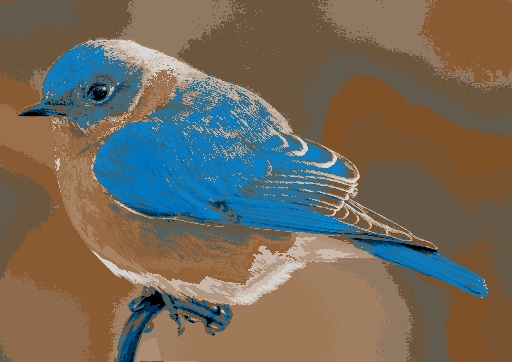
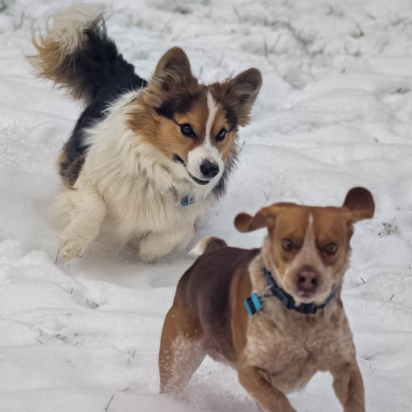
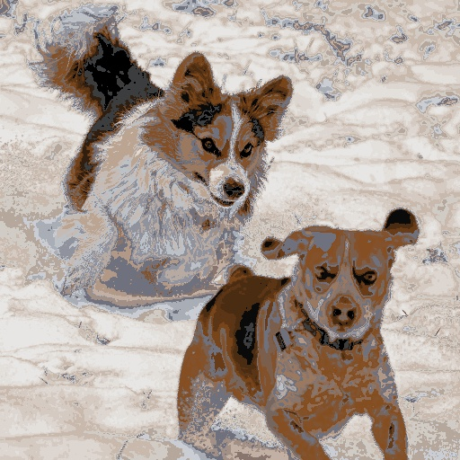
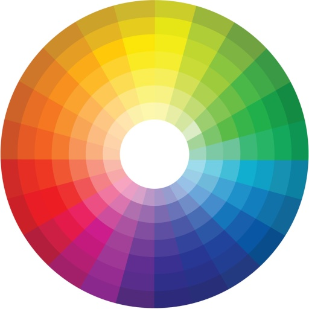
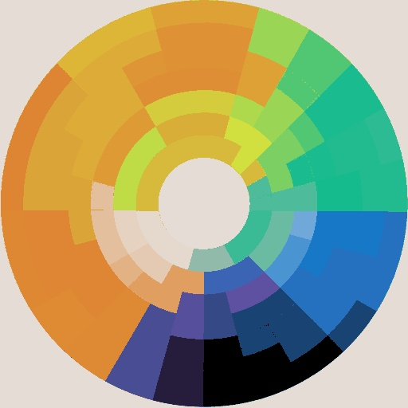

## Examples using v1.1.2

All have:
  - layer height = 0.04
  - max layers 50
  - background is #000000, 0.4
  - most are output size = 512

<table>

<tr><td>
<b>Test image: badlands</b> 
Used 9 colors from set of 10 filaments 
26 color swaps needed to print 
</td>
<td>decent</td>
</tr>
<tr>
  <td></td>
  <td></td>
</tr>
<tr><td>
 
 
</td></tr>

<tr><td>
<b>Test image: beagle</b> 
Used 4 colors from set of 4 filaments 
19 color swaps needed to print 
</td>
<td>dog looks good, background banding</td>
</tr>
<tr>
  <td></td>
  <td></td>
</tr>
<tr><td>
 
 
</td></tr>

<tr><td>
<b>Test image: bears</b> 
Used 5 colors from set of 7 filaments 
9 color swaps needed to print 
</td>
<td>good but never gets the blue teacups</td>
</tr>
<tr>
  <td></td>
  <td></td>
</tr>
<tr><td>
 
 
</td></tr>

<tr><td>
<b>Test image: bluebird</b> 
Used 7 colors from set of 7 filaments 
26 color swaps needed to print 
</td>
<td>good, noisy background</td>
</tr>
<tr>
  <td></td>
  <td></td>
</tr>
<tr><td>
 
 
</td></tr>

<tr><td>
<b>Test image: bluebird4c</b> 
Used 4 colors from set of 4 filaments 
21 color swaps needed to print 
</td>
<td>good for a 4-color version</td>
</tr>
<tr>
  <td></td>
  <td></td>
</tr>
<tr><td>
 
 
</td></tr>

<tr><td>
<b>Test image: chase</b> 
Used 5 colors from set of 6 filaments 
23 color swaps needed to print 
</td>
<td>bad banding in both dogs</td>
</tr>
<tr>
  <td></td>
  <td></td>
</tr>
<tr><td>
 
 
</td></tr>

<tr><td>
<b>Test image: colorwheel</b> 
Used 7 colors from set of 14 filaments 
12 color swaps needed to print 
</td>
<td>bad, needs more layers</td>
</tr>
<tr>
  <td></td>
  <td></td>
</tr>
<tr><td>
 
 
</td></tr>

<tr><td>
<b>Test image: corgi</b> 
Used 4 colors from set of 4 filaments 
21 color swaps needed to print 
</td>
<td>good</td>
</tr>
<tr>
  <td></td>
  <td></td>
</tr>
<tr><td>
 
 
</td></tr>

<tr><td>
<b>Test image: grizzly</b> 
Used 6 colors from set of 7 filaments 
17 color swaps needed to print 
</td>
<td>good but failed to preserve green background</td>
</tr>
<tr>
  <td></td>
  <td></td>
</tr>
<tr><td>
 
 
</td></tr>

<tr><td>
<b>Test image: hallowishes</b> 
Used 6 colors from set of 6 filaments 
14 color swaps needed to print 
</td>
<td>banding ruins the print</td>
</tr>
<tr>
  <td></td>
  <td></td>
</tr>
<tr><td>
 
 
</td></tr>

<tr><td>
<b>Test image: nature</b> 
Used 10 colors from set of 14 filaments 
24 color swaps needed to print 
</td>
<td>decent</td>
</tr>
<tr>
  <td></td>
  <td></td>
</tr>
<tr><td>
 
 
</td></tr>

<tr><td>
<b>Test image: raven</b> 
Used 6 colors from set of 8 filaments 
15 color swaps needed to print 
</td>
<td>good, easy one</td>
</tr>
<tr>
  <td></td>
  <td></td>
</tr>
<tr><td>
 
 
</td></tr>

<tr><td>
<b>Test image: vangelis</b> 
Used 6 colors from set of 6 filaments 
16 color swaps needed to print 
</td>
<td>good, also easy</td>
</tr>
<tr>
  <td></td>
  <td></td>
</tr>
<tr><td>
 
 
</td></tr>

</table>
