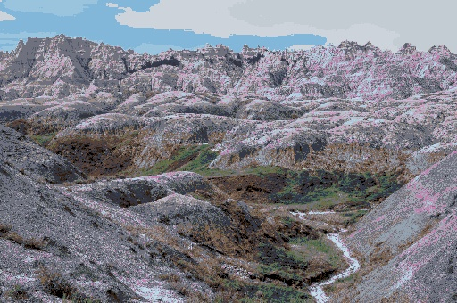

## Examples using v1.1.2

All have:
  - layer height = 0.04
  - max layers 50
  - background is #000000, 0.4
  - most are output size = 512

| Input Image | AutoForge Output |
| --- | --- |
|  |  |
|  |  |
|  |  |
|  |  |
|  |  |
